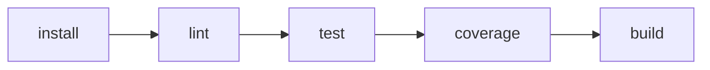

# CI Report

## Diagrama del pipeline

## Métricas de calidad (baseline actual)

- **Cobertura backend (pytest-cov total):** `84%`
- **Cobertura frontend (Vitest):**
  - Statements: `0.76%`
  - Branches: `0%`
  - Functions: `2.5%`
  - Lines: `0.78%`
- **Complejidad ciclomática (backend, cálculo estilo McCabe):**
  - Promedio por función: `3.59`
  - Máxima observada: `10` en `app/routers/cart.py::update_cart_item`
  - Funciones analizadas: `27`
- **Issues de lint (Pylint full scan, baseline):**
  - Total: `147`
  - Convención: `130`
  - Warnings: `13`
  - Refactor: `4`
  - Errores (`E`) bloqueantes en CI: `0` (stage usa `--errors-only`)

## Thresholds propuestos y justificación

- **Lint (gating):** `0` errores Pylint (`E*`) en cada PR.
  - Justificación: evita fallos funcionales/imports rotos con bajo riesgo de frenar por deuda histórica de estilo.
- **Cobertura backend mínima:** `80%` (actual `84%`).
  - Justificación: mantiene una red de seguridad razonable y ya es alcanzable por el estado actual.
- **Cobertura frontend mínima (fase inicial):** `>=1%` statements y crecimiento incremental por PR.
  - Justificación: baseline muy bajo; un umbral alto rompería continuamente el pipeline. Se prioriza tendencia de mejora sostenida.
- **Complejidad ciclomática máxima por función:** `<=15` (alerta desde `>10`).
  - Justificación: `10` ya existe en una función crítica; `15` permite evolución sin bloquear de inmediato y el umbral de alerta guía refactors.
